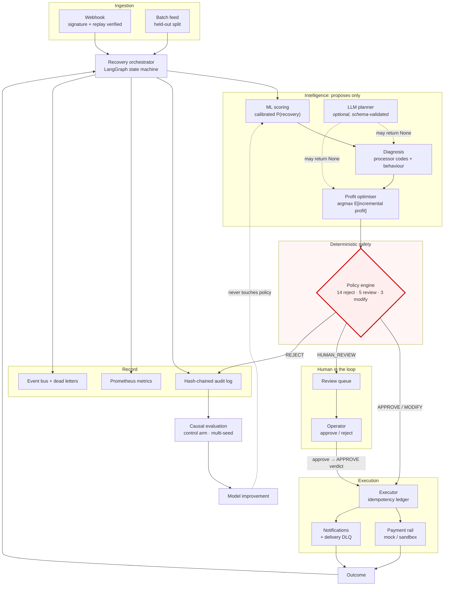
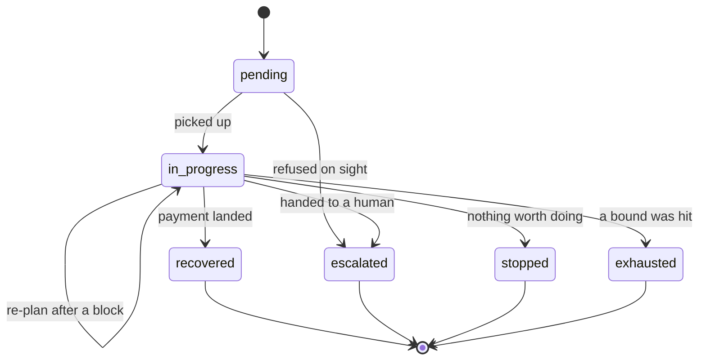

# Architecture

RecoverAI works a queue of failed payments end to end: score, diagnose, choose an
intervention, validate it against a deterministic policy engine, execute it idempotently,
observe the outcome, and stop.

The one design decision everything else follows from:

> **The model proposes; the policy engine disposes.**

No component (not the ML scorer, not the LLM planner, not the profit optimiser) can
cause a side effect. The executor's *input* is the policy engine's *output*, so there is
no code path from a proposal to a payment that skips the gate.

---

## The pipeline

The red box is load-bearing. Everything upstream of it is advisory.

---

## Module map

| Layer | Module | Responsibility |
|---|---|---|
| **Domain** | `backend/app/domain/money.py` | Exact money: integer minor units, Decimal arithmetic, one rounding site |
| | `backend/app/domain/states.py` | Case lifecycle; refuses illegal transitions |
| | `backend/app/domain/events.py` | Event vocabulary, in-process bus, dead letters |
| | `backend/app/domain/provenance.py` | Simulated / observational / randomised, and what each licenses |
| **Adapters** | `backend/app/adapters/gateway.py` | `PaymentRail` protocol; idempotency key is mandatory |
| | `backend/app/adapters/mock_rail.py` | The seeded simulator as a rail |
| | `backend/app/adapters/sandbox_rails.py` | Stripe / Razorpay sandbox, opt-in, live keys refused |
| | `backend/app/adapters/processor_codes.py` | Stripe/Razorpay/Adyen → one taxonomy; `UNKNOWN` is a real answer |
| **ML** | `backend/app/ml/{features,scorer}.py` | Feature build and calibrated serving |
| | `backend/app/ml/{uplift,targeting}.py` | T-learner, Qini, queue ranking by treatment effect |
| | `backend/app/ml/registry.py` | Immutable versions, lifecycle, promotion gate |
| | `backend/app/ml/drift.py` | Data / prediction / performance / business drift |
| **Decision** | `backend/app/decision/economics.py` | Cost model, loaded from `config/economics.yaml` |
| | `backend/app/decision/optimizer.py` | Expected incremental profit, with provenance on every estimate |
| **Agent** | `backend/app/agents/graph.py` | The LangGraph workflow |
| | `backend/app/agents/{diagnose,strategy}.py` | Deterministic diagnosis and planning |
| | `backend/app/agents/llm.py` | Optional planner; every failure degrades to rules |
| **Policy** | `backend/app/policies/engine.py` | The gate |
| | `backend/app/policies/version.py` | Version derived from rule source + limits |
| **Execution** | `backend/app/tools/executor.py` | The only code with side effects |
| **Security** | `backend/app/security/{auth,tokens,webhooks,ratelimit}.py` | Principals, roles, signatures, buckets |
| **Persistence** | `backend/app/database/{db,store,operational,review,migrations}.py` | SQLite/Postgres, tenant-scoped, versioned migrations |
| **Audit** | `backend/app/audit/store.py` | Append-only hash chain, versioned payload |
| **Experiments** | `backend/app/experiments/{assignment,stats}.py` | Deterministic randomisation, intervals, multi-seed |
| **API** | `backend/app/main.py`, `backend/app/api/*` | HTTP surface |

---

## The case lifecycle

Generated from `backend/app/domain/states.py`, so this diagram cannot drift from the code:

Terminal states have no outgoing edges, and `transition()` raises rather than following
one. A late-arriving webhook cannot resurrect a closed case.

---

## The three bounds on the loop

A planner that will not settle must not produce a case that never closes. Three
independent mechanisms guarantee termination:

1. **Retry and contact caps**, per-cause and global, in the policy engine.
2. **`MAX_AGENT_STEPS`**, an absolute ceiling on graph iterations (`R-STEP-CAP`).
3. **The recovery horizon**, measured from the original failure (`R-HORIZON`).

Plus LangGraph's own `recursion_limit`, set well above the step cap so it is a backstop
rather than the mechanism.

---

## What is deliberately absent

- **No Kafka, no Kubernetes, no microservices.** This is a modular monolith. The event
  bus is a protocol with an in-process implementation; a Redis adapter is a class, not a
  rewrite. Distributed infrastructure introduced for appearance is complexity with no
  corresponding problem.
- **No ORM.** Three stores, a handful of tables, and hand-written SQL that a reviewer can
  read. Migrations are a numbered list and a ledger.
- **No LLM in the critical path.** The deterministic planner is the default and beats the
  local models on diagnosis accuracy (see `scripts/bench_planner.py`). The LLM is opt-in.
