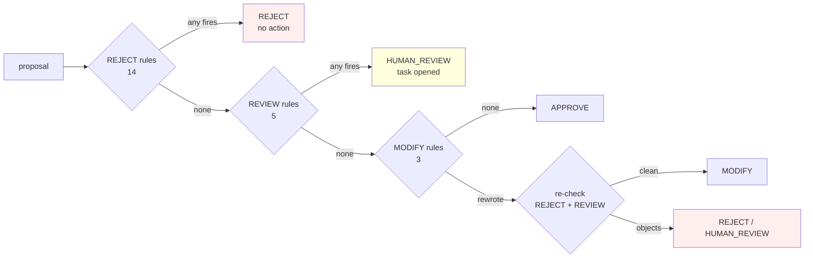

# The policy engine

The deterministic validator that stands between every proposal and every side effect.

```
ML / LLM / optimiser
        ↓
  candidate action
        ↓
┌───────────────────┐
│   POLICY ENGINE   │
└───────────────────┘
        ↓
APPROVE · MODIFY · HUMAN_REVIEW · REJECT
        ↓
   Executor (APPROVE / MODIFY only)
```

Four verdicts, and **exactly two permit execution**. That asymmetry is the design:
uncertainty resolves to *not acting*, never to acting anyway.

---

## Evaluation order



Three properties of this ordering are deliberate:

**REJECT short-circuits first.** A blocked action is never modified into an allowed one.

**REVIEW runs before MODIFY.** An action a human must approve is not rewritten first.
The operator has to approve the thing that was actually proposed.

**A rewritten action is re-validated from scratch.** Without this, a MODIFY rule can
synthesise an action the REJECT rules never saw. `R-ESCALATE-HIGH-VALUE` turning STOP into
ESCALATE_CASE slipped past `R-IDEMPOTENT` and could escalate the same case twice.

A rule that *raises* produces `HUMAN_REVIEW`, not an approval. A gate that crashes must
not become a gate that is bypassed.

---

## The rules

### REJECT: refused outright

| ID | What it stops |
|---|---|
| `R-ALLOWLIST` | Any action not in the `InterventionType` enum. The hard boundary an LLM cannot cross. |
| `R-TERMINAL` | Action on a closed case. |
| `R-RISK-BLOCK` | Anything but escalation on fraud / high-risk / compliance holds. |
| `R-DEAD-INSTRUMENT` | Retrying an expired or invalid payment method. |
| `R-PERSISTENT-NORETRY` | Retrying a closed or invalid account. |
| `R-DLQ` | Contact on a channel that has hard-bounced repeatedly for this customer. |
| `R-MAX-RETRIES` | Global retry ceiling. Nothing may raise it. |
| `R-CAUSE-RETRY-CAP` | Per-cause ceiling, tighter where the cause warrants. |
| `R-OPT-OUT` | Any contact to a customer who has withdrawn consent. |
| `R-CONTACT-CAP` | Contact beyond the per-case budget. |
| `R-HORIZON` | Action past the recovery horizon. |
| `R-STEP-CAP` | Action past the agent step ceiling. |
| `R-MIN-VALUE` | A paid contact chasing less than it costs to chase. |
| `R-IDEMPOTENT` | A once-only action repeated on one case. |

### HUMAN_REVIEW: withheld pending a person

| ID | Why a human |
|---|---|
| `R-AMOUNT-CAP` | Above the automatic ceiling, no money moves without approval. |
| `R-REVIEW-LOW-CONFIDENCE` | Diagnosis confidence below the floor. |
| `R-REVIEW-UNKNOWN-CAUSE` | The processor code could not be mapped at all. |
| `R-REVIEW-REPEATED-FAILURE` | Repeated execution failure on one case. |
| `R-REVIEW-SUPPORT-REQUESTED` | The customer asked for a person. |

`R-AMOUNT-CAP` used to be a REJECT. That was the wrong verdict: it dropped the most
valuable cases in the queue, so the system's safety limit was also its biggest revenue
leak. The message always said "human approval required"; now the decision does too.

Control flow (`WAIT`, `STOP`, `ESCALATE_CASE`) is exempt from every review rule.
"Do nothing" is the right response to uncertainty, and routing it to a person would flood
the queue with non-decisions.

### MODIFY: rewritten, then re-validated

| ID | Rewrite |
|---|---|
| `R-COOLDOWN` | Defers a retry to respect the minimum interval, rather than rejecting a legitimate action for being early. |
| `R-CHANNEL` | Switches to the customer's stated preferred channel. |
| `R-ESCALATE-HIGH-VALUE` | Turns a STOP on a high-value unrecovered case into an escalation, rather than dropping it silently. |

---

## Hard rules versus optimisation

Two kinds of constraint, kept structurally apart:

**Hard safety rules** live here, are deterministic, and no expected-profit calculation may
outbid them. `R-OPT-OUT` is the clearest case: a customer who has withdrawn consent is not
contacted regardless of how much money is on the table. That is why consent is a *rule*
and not a term in the objective, because a term can be outweighed.

**Optimisation** lives in `backend/app/decision/optimizer.py` and only ever narrows what
the planner proposes. It can decide an action is not worth taking; it can never decide one
is permitted.

Model retraining changes the first and never the second. `POLICY_VERSION` is derived from
the rules' own source plus the configured limits, so any change to either is visible in
every audit row it affected, and a model update that silently changed a retry cap would
show as a changed policy version, which is exactly the alarm you want.

---

## Structured verdicts

Never `True`/`False`:

```json
{
  "decision": "HUMAN_REVIEW",
  "rules_fired": ["R-AMOUNT-CAP"],
  "reason": "R-AMOUNT-CAP: $9,410.00 exceeds the automatic recovery ceiling of $5,000.00: human approval required",
  "effective_action": {"action": "retry_payment", "delay_hours": 0.0}
}
```

`effective_action` is populated on a `HUMAN_REVIEW` verdict so an operator can see exactly
what was proposed. It is **not** executable: `PolicyResult.allowed` is False, and the
executor raises `PolicyViolation` on anything whose decision is not `APPROVE` or `MODIFY`.
Reading "there is an action attached" as "you may run it" is the bug that property
prevents, and `test_a_human_review_verdict_carries_an_action_but_is_still_refused` pins it.

---

## Configuration, not code

Every threshold is an environment variable, listed in one place
(`backend/app/config.py`):

```
RECOVERAI_MAX_RETRIES              global retry ceiling
RECOVERAI_MIN_RETRY_HOURS          cooldown between re-presentments
RECOVERAI_MAX_AUTO_AMOUNT          above this, a human approves
RECOVERAI_MAX_CONTACTS             customer touches per case
RECOVERAI_MAX_STEPS                agent loop ceiling
RECOVERAI_HORIZON_DAYS             recovery horizon
RECOVERAI_MIN_EV                   floor for a paid contact
RECOVERAI_REVIEW_MIN_CONFIDENCE    diagnosis confidence floor
RECOVERAI_REVIEW_MAX_FAILURES      consecutive failures before suspension
RECOVERAI_REVIEW_SLA_HOURS         how long a review task stays actionable
```

`GET /api/v1/policy` returns the whole envelope (every rule ID by tier, every limit, and
the derived version hash), so "what were the limits when this decision was taken" is
answerable without reading source.

---

## Testing

`backend/tests/test_policy.py` has one test per rule and a meta-test that fails if any
registered rule has no test naming its ID. The safety envelope cannot grow untested.

Beyond the per-rule tests, the properties under test are:

- a rejection never yields an executable action;
- rejection short-circuits before modification;
- validation is pure and repeatable;
- no risk/compliance case can ever be retried, swept across the entire failure taxonomy;
- a rule that raises fails closed to `HUMAN_REVIEW`.
