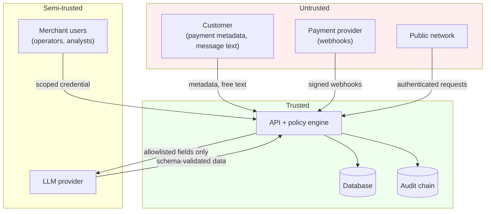

# Threat model

Scope: the RecoverAI service, its data stores, its payment-rail adapters, and the LLM
boundary. Out of scope: the payment provider's own systems, the host operating system,
and physical access.

Ratings are the authors' judgement, not the output of a formal process. **This system has
not had an external security review**, and every "residual: low" below should be read as
"low given the mitigations we believe are in place", not as an assurance.

---

## Trust boundaries

---

## Threats

### T1. Malicious customer: prompt injection via payment metadata

**Impact:** an attacker embeds instructions in a name or a processor message hoping the
LLM will authorise a retry, unblock a fraud hold, or exfiltrate other customers' data.
**Likelihood:** high (trivially attempted).
**Mitigation:** the model receives a thirteen-field allowlist, never a record; `scrub()`
is a second pass; its output is a Pydantic model whose `action` is a closed enum; it holds
no tools; and the policy engine evaluates its proposal exactly as it would any other. A
successful injection produces a *proposal*, and every limit that matters is enforced
downstream of proposals.
**Residual:** **low** for authorisation bypass. **Medium** for *reasoning-quality*
degradation: injected text could make the model produce a plausible-but-wrong diagnosis
inside the allowed action space, which policy cannot detect. Mitigated in part by the
confidence floor routing uncertain diagnoses to a human.

### T2. Malicious customer: forged webhook marking invoices paid

**Impact:** settled invoices that were never paid; recovery abandoned on live debt.
**Likelihood:** medium.
**Mitigation:** HMAC over `timestamp.body`, constant-time compared; freshness window;
replay cache keyed on the signature; size cap before hashing; parse only after
verification; unconfigured secret refuses everything.
**Residual:** **low**, conditional on the secret being managed properly. A leaked webhook
secret defeats all of it, which makes rotation an operational requirement, not a nicety.

### T3. Compromised merchant API key

**Impact:** read or act within that key's tenant and role.
**Likelihood:** medium (keys leak into repos, CI logs, laptops).
**Mitigation:** keys are role-scoped and tenant-scoped; only a PBKDF2 hash is stored;
`SYSTEM` keys can execute but hold no interactive powers; `OPERATOR` keys can approve but
cannot change limits; every override is recorded with actor, time and reason.
**Residual:** **medium**. There is no key expiry, no rotation workflow, and no anomaly
detection on key use. A stolen `SYSTEM` key can execute recovery actions within the policy
envelope until someone notices. **Open.**

### T4. Malicious or careless merchant user (insider)

**Impact:** approving reviews that should be rejected; a policy change that widens the
envelope.
**Likelihood:** low, but the highest-impact insider path.
**Mitigation:** `ADMIN` and `OPERATOR` are separated so the person who sets the limits is
not the person who approves actions under them; every override is append-only with a
mandatory reason; a resolved task cannot be re-decided; overrides are readable by
`AUDITOR`, a role that can approve nothing.
**Residual:** **medium**. Detection is after the fact. There is no dual-control on
high-value approvals and no alerting on unusual override rates. **Open.**

### T5. Cross-tenant data access

**Impact:** one merchant reads another's customers, amounts and decisions.
**Likelihood:** low.
**Mitigation:** the tenant comes from the credential and never from the request; every
store is constructed tenant-scoped; `tenant_id` is in the primary key of `cases` and
`runs`; a cross-tenant read returns 404 rather than 403; nine explicit isolation tests.
**Residual:** **low**, with the caveat that this is enforced in application code. A
database-level policy (Postgres RLS) would make it enforced by the engine.

### T6. Replayed or duplicated action (double charge)

**Impact:** a customer charged twice.
**Likelihood:** medium (network retries, at-least-once delivery, operator double-click).
**Mitigation:** three layers. The executor keys on
`SHA256(transaction, action, attempt)` and returns the cached result; the `ActionLedger`
makes that durable across restarts, scoped by `run_id`; the rail adapter passes the key to
the provider's own idempotency header, so a call whose response was lost in transit is
deduplicated by the provider rather than by us guessing.
**Residual:** **low** within a run. Cross-run replay is deliberately *not* deduplicated,
because run scoping is what stops a second experiment silently returning the first's
cached results. A production deployment must therefore set `run_id` to something
stable, not per-process.

### T7. Gateway outage misread as a decline

**Impact:** a five-minute processor blip burns a customer's entire retry budget; or worse,
an ambiguous call is treated as failed while the charge landed.
**Likelihood:** high (outages are routine).
**Mitigation:** `GatewayUnavailable` is a distinct exception from a
`GatewayResult(success=False)`. The state of the payment is *unknown*, so the caller
re-presents under the same idempotency key rather than as a new attempt.
**Residual:** **medium**. The distinction exists in the adapter layer; the orchestrator
does not yet implement a full reconciliation pass for payments left in an unknown state.
**Open.**

### T8. Database compromise

**Impact:** disclosure of customers, amounts, and decision history.
**Likelihood:** low.
**Mitigation:** the audit log stores an `input_hash` rather than the inputs, so it is not
a second copy of the customer database. Modification is detectable: the chain re-derives
and `verify()` reports the first bad sequence number.
**Residual:** **high for confidentiality.** There is no encryption at rest, no field-level
encryption, and no key management. This is the largest open gap. **Open.**

### T9. Insider modification of the audit log

**Impact:** a decision history that no longer reflects what happened.
**Likelihood:** low.
**Mitigation:** each row's hash covers the previous row and its own field set; the store
exposes no update or delete method; `hash_version` is inside the hashed payload so a row
cannot be downgraded to drop the columns a later version covers; an unknown version
refuses rather than passing, because "cannot verify" must never render as "verified".
**Residual:** **medium**. Detection, not prevention. Anyone with write access can truncate
the whole table; the chain proves *that* it happened, not who. External anchoring (a
periodic root hash written somewhere else) would close this. **Open.**

### T10. Policy bypass

**Impact:** an action executes that no rule approved.
**Likelihood:** low.
**Mitigation:** the executor's input *is* the gate's output; passing an unapproved verdict
raises `PolicyViolation`; a rule that raises fails closed to `HUMAN_REVIEW`; a rewritten
action is re-validated from scratch; `R-ALLOWLIST` refuses anything outside the enum.
**Residual:** **low**. The failure mode that remains is a bug in a rule's *logic*, a rule
that is present and wrong, which no amount of structure prevents. One test per rule, and
a meta-test that fails if a rule has no test, is the countermeasure.

### T11. Model poisoning

**Impact:** training data manipulated so the model systematically mis-ranks, or a
retrained model quietly widens what gets automated.
**Likelihood:** low here (the dataset is synthetic or public), higher in a deployment
retraining on production outcomes.
**Mitigation:** **model retraining cannot change policy.** The limits are configuration
and the rules are code; `POLICY_VERSION` is derived from the rules' source plus the
limits, so any change shows in every audit row. The registry gates promotion on a quality
floor and a regression tolerance, refuses to serve an unapproved model, and records a
forced promotion with what it overrode.
**Residual:** **medium**. There is no data-provenance verification on the training set
and no adversarial-robustness testing. **Open.**

### T12. Data leakage into the model (feature leakage)

**Impact:** offline metrics that cannot be reproduced in production; a system that looks
excellent and is not.
**Likelihood:** medium (it is easy to do by accident).
**Mitigation:** `to_transactions()` drops the `recovered` and `recovery_days` labels
before any live run, so an agent cannot see the outcome of the case it is working. Splits
are grouped by `customer_id`, so the same customer never appears in both train and test.
Feature vocabulary is derived from the enums, not from whatever appeared in the training
file, so training and serving cannot drift apart.
**Residual:** **medium**. See `docs/ml.md`: the synthetic dataset has no event timestamp,
so *temporal* validation is not possible as built. Grouped splitting is a weaker control
than a time-ordered one. **Open.**

### T13. Denial of service

**Impact:** the API is unavailable; or an expensive path is used as an amplifier.
**Likelihood:** medium.
**Mitigation:** 1 MB body cap enforced in middleware before the body is read; token-bucket
rate limiting; webhook size cap before hashing; the LLM is routed by expected value so the
expensive model is not reachable on a low-value case; the agent loop is bounded three ways.
**Residual:** **medium**. Rate limiting is per-process, so *N* replicas allow *N* times the
configured rate. No upstream WAF or CDN is assumed. **Open.**

---

## Summary of open risks

| # | Risk | Residual | What would close it |
|---|---|---|---|
| T8 | No encryption at rest | **high** | Field-level encryption + a KMS |
| T3 | No key rotation or expiry | medium | Key lifecycle, anomaly detection on key use |
| T4 | Insider approval abuse detected only after the fact | medium | Dual control on high-value approvals; alerting on override rate |
| T7 | No reconciliation for payments in an unknown state | medium | A reconciliation pass against provider status |
| T9 | Audit tampering is detectable, not preventable | medium | External anchoring of the chain root |
| T11 | No training-data provenance | medium | Signed datasets; adversarial evaluation |
| T12 | Grouped, not temporal, validation | medium | Event timestamps in the schema; time-ordered splits |
| T13 | Rate limiting is per-process | medium | A shared limiter (Redis) or an upstream WAF |
| T1 | Injection can degrade reasoning within the allowed action space | medium | Adversarial evaluation of the diagnosis layer |
